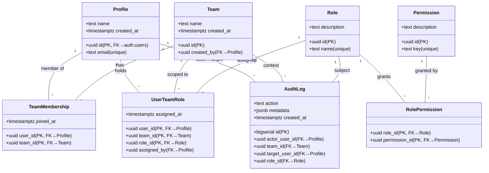
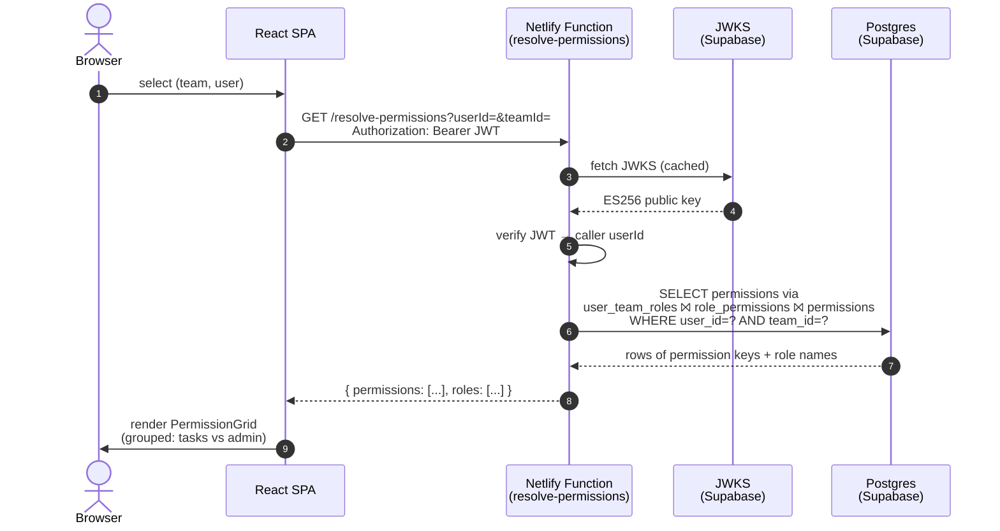
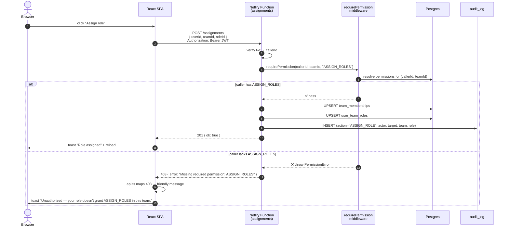

# Rengy RBAC — Team Management System

Full-stack RBAC app: users belong to teams, get one or more roles per team, and roles bundle permissions. Permissions are resolved per `(user, team)` and enforced both server-side (middleware) and in the UI.

**Stack:** React + Vite + Tailwind + shadcn-style primitives · Netlify Functions (TypeScript) · Supabase (Postgres + Auth)

---

## About

This is a small Team Management System built around **role-based access control scoped per team**. The same person can wear different hats in different teams: Alice is an **Admin** in Team Alpha but only a **Viewer** in Team Beta — and the system reflects that everywhere it shows what she can do.

The core idea:

- **Permissions** are atomic actions (`CREATE_TASK`, `EDIT_TASK`, `DELETE_TASK`, `VIEW_ONLY`, `MANAGE_TEAM`, `MANAGE_MEMBERS`, `ASSIGN_ROLES`).
- **Roles** are reusable bundles of permissions (e.g. *Admin*, *Manager*, *Viewer*).
- **Teams** are the scope. A user's permissions are computed from the roles they hold *in that specific team* — not globally.
- **No role in a team → no permissions in that team.** This is enforced literally: the resolver returns an empty set.
- **Multiple roles per (user, team)** are supported. The effective permission set is the **union** of all assigned roles.

The dashboard lets you pick any `(team, user)` pair and see exactly what they're allowed to do, with the same logic that the backend uses to gate API calls. So what the UI shows and what the server enforces can never drift apart.

### Why this design

| Choice | Why |
|---|---|
| Permissions are global, not per-team | Roles are reusable across teams; a single permission catalog keeps the model simple. |
| Roles are global too | Same reason — *Admin* means the same thing wherever it's used. |
| The `(user, team, role)` triple is the join | Lets a user have different roles in different teams *and* multiple roles in one team. |
| Service-role key on the server only | All data access goes through Netlify Functions; the browser never holds a key that bypasses RLS. |
| RLS enabled and **deny-all** | The only path to data is through middleware-checked endpoints. No accidental leaks. |
| JWT verified via Supabase JWKS | Asymmetric (ES256/RS256) — no shared secret to manage. |

---

## Architecture

```
┌──────────────────┐    Bearer JWT     ┌────────────────────────┐    service-role    ┌──────────────┐
│  React SPA       │ ────────────────▶ │  Netlify Functions     │ ─────────────────▶ │  Supabase    │
│  (Vite/Tailwind) │                   │  • requireAuth (JWKS)  │                    │  Postgres    │
│  • TeamSelector  │ ◀──────────────── │  • requirePermission   │ ◀───────────────── │  + RLS       │
│  • UserPicker    │      JSON         │  • writeAudit          │                    │  + auth.users│
│  • Permission    │                   └────────────────────────┘                    └──────┬───────┘
│    Grid          │                                                                        │
└────────┬─────────┘                                                                        │
         │ supabase-js (anon key) — Auth only (signup / login / refresh)                    │
         └────────────────────────────────────────────────────────────────────────────────▶ │
                                                                                  Supabase Auth
```

The browser never talks to the database directly. It only talks to **Supabase Auth** (to obtain a JWT) and to the **Netlify Functions** (to read/write data with that JWT). The Functions verify the JWT, check the caller's permissions in the relevant team, then operate on Postgres using the service-role key.

---

## Data model — class diagram



**Key relationships:**

- `team_memberships` is a pure many-to-many between `Profile` and `Team`.
- `role_permissions` is a pure many-to-many between `Role` and `Permission`.
- `user_team_roles` is the **three-way join** that drives everything. Its composite PK `(user_id, team_id, role_id)` allows a user to hold *multiple roles* in one team while preventing duplicate assignments.

---

## Sequence — resolving a user's permissions

This is what powers the Dashboard's permission grid and the server-side permission check.



**Notes:**
- The JWKS is fetched once per Function instance and cached by `jose.createRemoteJWKSet`.
- The query returns the **distinct union** of permission keys across every role the user has in that team — handling the "multiple roles per (user, team)" case automatically.
- If the user has no rows in `user_team_roles` for that team, the result is `{ permissions: [], roles: [] }` — the "no role → no permissions" rule.

---

## Sequence — performing a protected action

This shows what happens when a user attempts a mutation (e.g. assigning a role). The middleware re-runs the same resolver before allowing the change.



**Notes:**
- Every mutating endpoint runs the same `requirePermission` check — the rules can't be bypassed by hitting the API directly with a valid login JWT.
- The audit row is written **after** the change, with the actor, target, team, role, and `metadata` (e.g. the previous role for an `UPDATE_ROLE`).
- The frontend's [`api.ts`](src/lib/api.ts) maps `401`/`403` HTTP statuses into human-readable messages so callers don't have to think about it.

---

## API surface

All endpoints sit at `/.netlify/functions/<name>` (also aliased to `/api/<name>` via `netlify.toml`). All require `Authorization: Bearer <JWT>` except the auth flow itself (which goes directly to Supabase Auth from the browser).

| Endpoint | Methods | Purpose | Permission required |
|---|---|---|---|
| `/users` | GET, POST | List (search + paginate) / create | – / authed |
| `/teams` | GET, POST | List (paginate) / create | – / authed |
| `/memberships` | GET, POST, DELETE | List members or user's teams / add / remove | – / `MANAGE_MEMBERS` / `MANAGE_MEMBERS` |
| `/roles` | GET, POST | List with permissions / create | – / authed |
| `/roles/:id/permissions` | POST | Replace or extend a role's permission set | authed |
| `/permissions` | GET | List all permission keys | – |
| `/assignments` | GET, POST, PUT, DELETE | List / assign / swap / remove role-in-team | – / `ASSIGN_ROLES` (mutations) |
| `/resolve-permissions` | GET | `{ permissions, roles }` for `(userId, teamId)` | – |
| `/audit` | GET | Audit log feed | needs `MANAGE_TEAM` ∨ `MANAGE_MEMBERS` ∨ `ASSIGN_ROLES` *anywhere* |

---

## Setup

1. `npm install`
2. Create a Supabase project. From **Project Settings → API** copy:
   - Project URL → `SUPABASE_URL` and `VITE_SUPABASE_URL`
   - `anon` public key → `VITE_SUPABASE_ANON_KEY`
   - `service_role` secret key → `SUPABASE_SERVICE_ROLE_KEY`
   (JWT verification uses the project's JWKS endpoint automatically — no JWT secret needed.)
3. `cp .env.example .env` and paste values.
4. Run the migration: in Supabase **SQL Editor**, paste the contents of [`supabase/migrations/0001_init.sql`](supabase/migrations/0001_init.sql) and execute.
5. Seed: `npm run seed` (creates Admin/Manager/Viewer roles, the 7 permissions, two demo teams, and two demo users).
6. `npm install -g netlify-cli` then `netlify dev` — opens the SPA on http://localhost:8888 with functions on the same origin.

## Demo credentials (after `npm run seed`)

- **alice@example.com / Password123!** — Admin in Team Alpha, Viewer in Team Beta (the spec example)
- **bob@example.com / Password123!** — Manager in Team Beta

The login screen shows one-click buttons for both.

## Acceptance test

Log in as Alice → Dashboard auto-selects her and her first team → permission grid renders. Switch the team selector between **Team Alpha** and **Team Beta** to see the same user's permissions change in real time:

- **Team Alpha**: all 7 permissions granted (role: *Admin*).
- **Team Beta**: only `VIEW_ONLY` granted (role: *Viewer*).

This is the literal scenario from the brief — and the same query that drives the UI is what the backend uses to gate every mutation.
