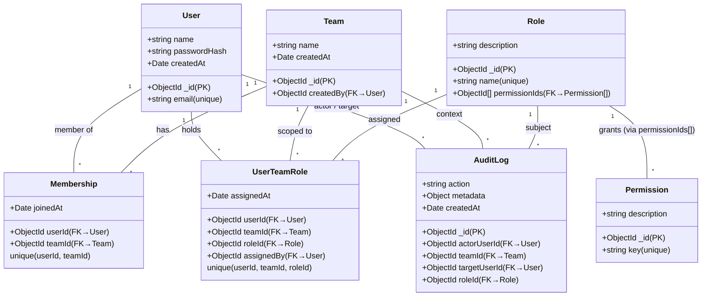
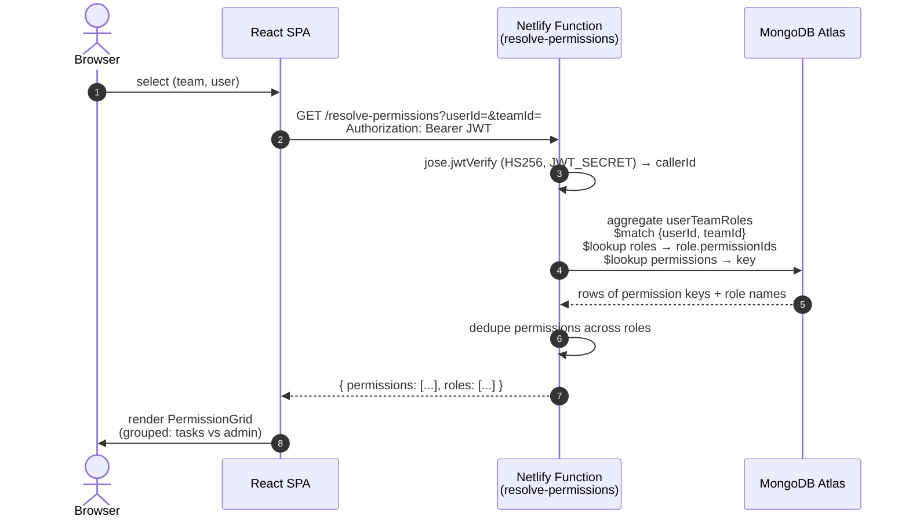
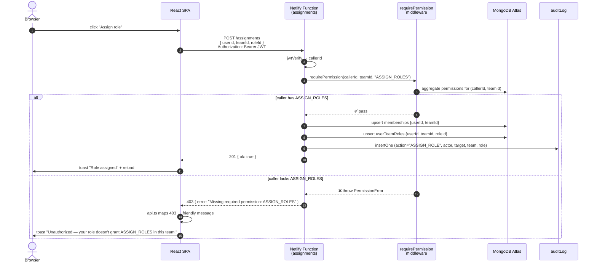

# Rengy RBAC — Team Management System

Full-stack RBAC app: users belong to teams, get one or more roles per team, and roles bundle permissions. Permissions are resolved per `(user, team)` and enforced both server-side (middleware) and in the UI.

**Stack:** React + Vite + Tailwind · Netlify Functions (TypeScript) · **MongoDB Atlas** · custom JWT auth (bcrypt + HS256)

---

## About

This is a small Team Management System built around **role-based access control scoped per team**. The same person can wear different hats in different teams: Alice is an **Admin** in Team Alpha but only a **Viewer** in Team Beta — and the system reflects that everywhere it shows what she can do.

The core idea:

- **Permissions** are atomic actions (`CREATE_TASK`, `EDIT_TASK`, `DELETE_TASK`, `VIEW_ONLY`, `MANAGE_TEAM`, `MANAGE_MEMBERS`, `ASSIGN_ROLES`).
- **Roles** are reusable bundles of permissions (e.g. *Admin*, *Manager*, *Viewer*).
- **Teams** are the scope. A user's permissions are computed from the roles they hold *in that specific team* — not globally.
- **No role in a team → no permissions in that team.**
- **Multiple roles per (user, team)** are supported. The effective permission set is the **union** of all assigned roles.

The dashboard lets you pick any `(team, user)` pair and see exactly what they're allowed to do, with the same logic that the backend uses to gate API calls.

### Why this design

| Choice | Why |
|---|---|
| Permissions and roles are global, scopes are per-team | Roles like *Admin* mean the same thing across teams; only the `(user, team, role)` join changes per scope. |
| `userTeamRoles` collection with composite uniqueness on `(userId, teamId, roleId)` | Lets a user hold different roles in different teams *and* multiple roles in one team without duplicates. |
| Custom JWT auth (HS256) signed by Functions | The spec calls for "MERN + JWT". No third-party auth dependency; bcrypt-hashed passwords live in Mongo. |
| Mongo client cached across lambda invocations | Atlas free-tier connection limits + serverless cold starts. |
| All data access goes through Functions | The connection string is server-only; the browser only ever holds a short-lived JWT. |

---

## Architecture

```
┌──────────────────┐    Bearer JWT     ┌────────────────────────┐    MongoClient    ┌──────────────┐
│  React SPA       │ ────────────────▶ │  Netlify Functions     │ ────────────────▶ │  MongoDB     │
│  (Vite/Tailwind) │                   │  • requireAuth (HS256) │                   │  Atlas       │
│  • TeamSelector  │ ◀──────────────── │  • requirePermission   │ ◀──────────────── │  (rengy DB)  │
│  • UserPicker    │      JSON         │  • writeAudit          │                   └──────────────┘
│  • Permission    │                   └────────────────────────┘
│    Grid          │                              │
└────────┬─────────┘                              │ POST /auth-login, /auth-signup
         │                                        │ (bcrypt compare → sign JWT)
         └─── stores JWT in localStorage  ────────┘
```

The browser holds a JWT in `localStorage` (issued by `/auth-login` or `/auth-signup`) and includes it on every request. Every Function except the auth endpoints calls `requireAuth(event)` which verifies the token's HS256 signature with `JWT_SECRET`. Mutating endpoints additionally call `requirePermission(userId, teamId, perm)` which runs an aggregation against MongoDB to compute the caller's effective permissions in that team.

---

## Data model — class diagram



**Key relationships:**

- `memberships` is a pure many-to-many between `User` and `Team`.
- `roles.permissionIds` is an embedded array of permission ObjectIds — a denormalized many-to-many, fast for the hot resolver path.
- `userTeamRoles` is the **three-way join** that drives everything. Its compound unique index on `(userId, teamId, roleId)` allows a user to hold *multiple roles* in one team while preventing duplicates.

---

## Sequence — resolving a user's permissions

This is what powers the Dashboard's permission grid and the server-side permission check.



**Notes:**
- The MongoClient is cached across Lambda invocations to avoid TLS handshakes on every cold start.
- The aggregation returns the **union** of permission keys across every role the user has in that team.
- If `userTeamRoles` has no document matching `(userId, teamId)`, the result is `{ permissions: [], roles: [] }` — the "no role → no permissions" rule.

---

## Sequence — performing a protected action

This shows what happens when a user attempts a mutation (e.g. assigning a role).



**Notes:**
- Every mutating endpoint runs the same `requirePermission` check — the rules can't be bypassed by hitting the API directly with a valid login JWT.
- The audit row is written **after** the change, with the actor, target, team, role, and `metadata` (e.g. the previous role for an `UPDATE_ROLE`).
- Creating a team also auto-grants the creator the **Admin** role on that team (and writes an `ASSIGN_ROLE` audit row alongside the `CREATE_TEAM` row).

---

## API surface

All endpoints sit at `/.netlify/functions/<name>` (also aliased to `/api/<name>` via `netlify.toml`). All require `Authorization: Bearer <JWT>` except `/auth-login` and `/auth-signup`.

| Endpoint | Methods | Purpose | Permission required |
|---|---|---|---|
| `/auth-signup` | POST | Create account, return JWT | – |
| `/auth-login` | POST | Verify credentials, return JWT | – |
| `/auth-me` | GET | Return the current user | authed |
| `/users` | GET, POST | List (search + paginate) / create | authed |
| `/teams` | GET, POST | List (paginate) / create (creator becomes Admin) | authed |
| `/memberships` | GET, POST, DELETE | List members or user's teams / add / remove | – / `MANAGE_MEMBERS` / `MANAGE_MEMBERS` |
| `/roles` | GET, POST | List with permissions / create | authed |
| `/roles/:id/permissions` | POST | Replace or extend a role's permission set | authed |
| `/permissions` | GET | List all permission keys | authed |
| `/assignments` | GET, POST, PUT, DELETE | List / assign / swap / remove role-in-team | – / `ASSIGN_ROLES` (mutations) |
| `/resolve-permissions` | GET | `{ permissions, roles }` for `(userId, teamId)` | authed |
| `/audit` | GET | Audit log feed | needs `MANAGE_TEAM` ∨ `MANAGE_MEMBERS` ∨ `ASSIGN_ROLES` *anywhere* |

---

## Setup

1. `npm install`
2. Create a MongoDB Atlas cluster (free tier is fine). In **Database Access** create a user; in **Network Access** allow your IP (and `0.0.0.0/0` for the Netlify deploy).
3. `cp .env.example .env` and fill in:
   - `MONGODB_URI` — your Atlas connection string (with username + password)
   - `MONGODB_DB` — keep `rengy` or pick another name
   - `JWT_SECRET` — generate with `openssl rand -base64 32`
4. Create indexes: `npm run db:init`
5. Seed demo data: `npm run seed` (creates Admin/Manager/Viewer roles, the 7 permissions, two demo teams, and two demo users).
6. `npm install -g netlify-cli` then `netlify dev` — opens the SPA on http://localhost:8888 with functions on the same origin.

## Demo credentials (after `npm run seed`)

- **alice@example.com / Password123!** — Admin in Team Alpha, Viewer in Team Beta (the spec example)
- **bob@example.com / Password123!** — Manager in Team Beta

The login screen shows one-click buttons for both.

## Acceptance test

Log in as Alice → Dashboard auto-selects her and her first team → permission grid renders. Switch the team selector between **Team Alpha** and **Team Beta** to see the same user's permissions change in real time:

- **Team Alpha**: all 7 permissions granted (role: *Admin*).
- **Team Beta**: only `VIEW_ONLY` granted (role: *Viewer*).

This is the literal scenario from the brief — and the same aggregation that drives the UI is what the backend uses to gate every mutation.
